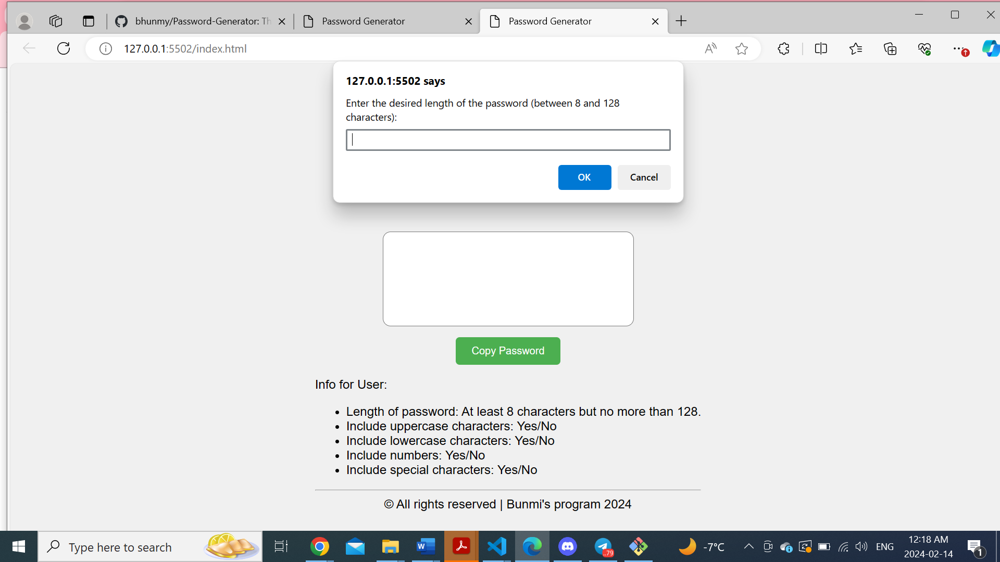
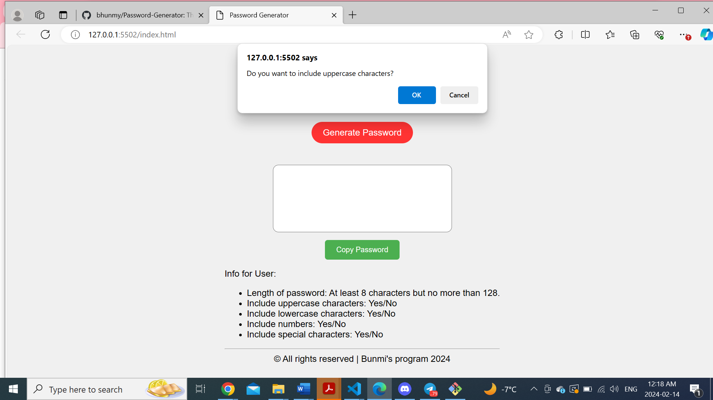
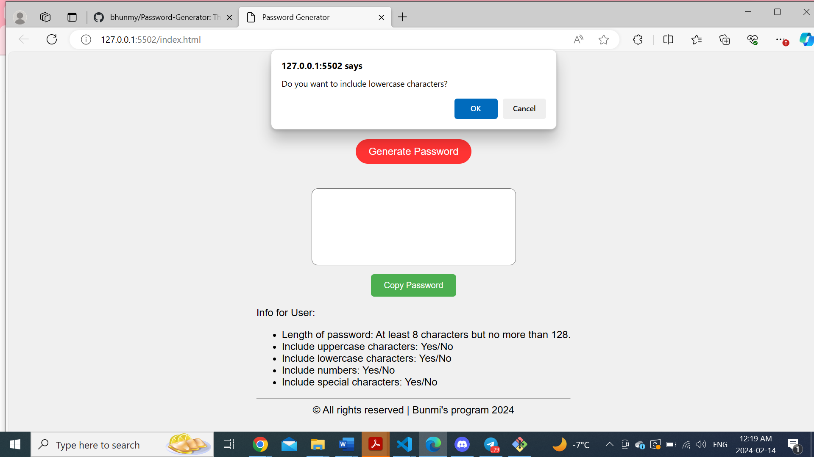
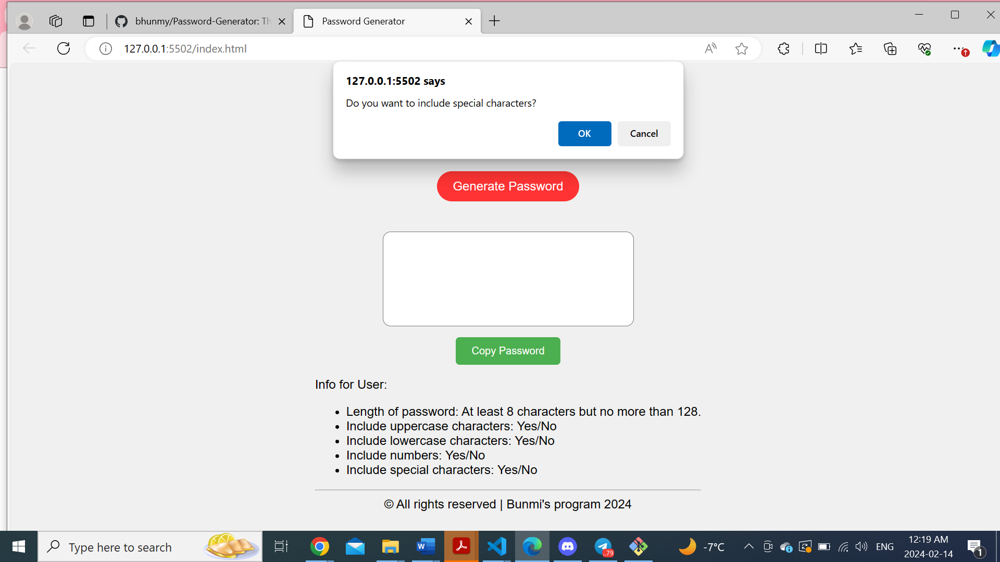
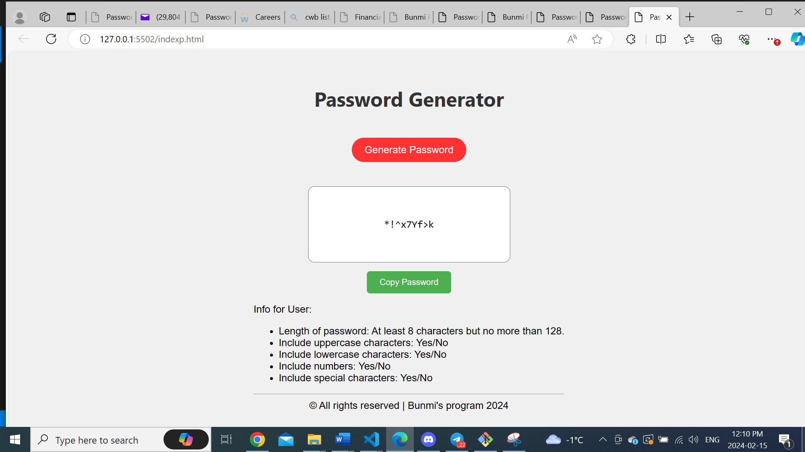

# Password-Generator
This portfolio showcase an application to generate random  password
# Password Generator

This is a simple web-based password generator that allows users to specify the length of the password and select the types of characters to include. The generated password is displayed either in an alert on the web page itself.

## How to Use

1. Open the `index.html` file in a web browser.

2. Click on the "Generate Password" button.

3. Follow the prompts to specify the length of the password and select the types of characters to include (lowercase, uppercase, numeric, special).
 

4. Once you've made your selections, a password will be generated and displayed in an alert.

5. Click on the copy password to copy the generated password.

## Features

- Specify the length of the password (between 8 and 128 characters).
- Select the types of characters to include:
  - Lowercase
  - Uppercase
  - Numeric
  - Special characters ($@%&*, etc)
- Validates user inputs to ensure the password length is within the specified range and at least one character type is selected.
- Generates a random password based on the specified criteria.

## Technologies Used

- HTML
- CSS
- JavaScript

## License

This project is licensed under the MIT License
